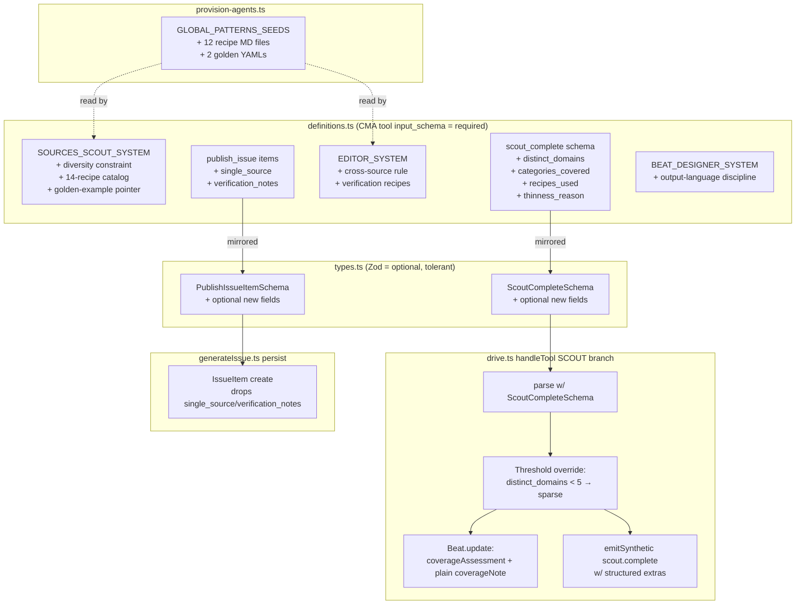

# Plan — Bullet-proof agents (T1 + T3)

## Context

`tasks/raw_findings.md` says built-in `web_search` is too generic for newsletter
sourcing — same-domain bias, no curation memory, no clustering. Today's scout
ships sources skewed to a handful of SEO-strong domains; today's editor
self-grades coverage with no validation. `tasks/bullet-proof-agents-spec.md`
proposes Tier 1 (prompt + schema hardening: domain-diversity constraint, recipe
catalog, golden examples, Wasp-side threshold override) and Tier 3 (recipe
seeds in `global_patterns`, optional Tavily key). Tier 2 (critic+retry) is
deferred.

**Goal:** scout produces sources from ≥6 distinct eTLD+1 domains across ≥3
categories using ≥3 recipes; editor items at depth=standard/deep are
corroborated by 2 distinct-domain sources. Land as one re-provisioning pass.

## Spec audit — corrections vs draft

The draft plan caught these; this plan keeps the corrections.

1. **Spec §2.3 file path is wrong.** `scout_complete` is handled in
   `src/server/agents/drive.ts:764-789`, not `src/server/jobs/generateIssue.ts`.
   The threshold override belongs in `drive.ts`.
2. **No DB migration this pass.** `Beat`/`IssueItem` schemas don't have the new
   fields. Migration deferred until UI surfaces them.
3. **Tavily env wiring deferred.** Spec §4 admits the `dedicated_api_keys`
   field name is unverified against the current CMA env API. Skip env wiring;
   seed the recipe doc only.

And one new correction:

4. **`Beat.coverageNote` is rendered as a plain string** to users in
   `src/pages/beat/ActivePanel.tsx:254` and `IssueDetailPage.tsx:153`.
   JSON-packing structured fields into that column (draft option A) would
   regress the UI to displaying raw JSON. Plan instead stashes the new
   structured fields ONLY in the synthetic `scout.complete` `AgentEvent`
   payload (already JSON, already JSON.parse'd by the transcript reader).
   `Beat.coverageNote` keeps holding the agent's plain-text `notes`.

## Shape of the change



## Files to modify

### `src/server/agents/definitions.ts`

- **`SOURCES_SCOUT_SYSTEM`** — insert spec §2.1 verbatim (domain-diversity
  HARD constraint, 14-recipe catalog, golden-example pointer) AFTER the
  current "## Source categories to cover" block (~line 203) and BEFORE
  "## Language" (~line 205).
- **`sourcesScoutDefinition.tools[scout_complete].input_schema`** — replace
  per spec §2.2:
  - Add `distinct_domains` (integer, required), `categories_covered` (enum
    array of `official|press|community|aggregator|primary_data|expert`,
    required), `recipes_used` (string array, required), `thinness_reason`
    (string, optional).
  - Update the `description` to spell out the diversity threshold so the
    model self-grades correctly.
- **`EDITOR_SYSTEM`** — insert spec §2.4 cross-source requirement after
  step 2 (CLUSTER); insert verification-recipes block after step 5
  (VERIFY).
- **`editorDefinition.tools[publish_issue]` items** — add `single_source`
  (boolean, optional) and `verification_notes` (string, optional). Not in
  `required[]` so backward compatible.
- **`BEAT_DESIGNER_SYSTEM`** — insert spec §2.6 output-language discipline
  before the "## Tone" block.

No model swaps. No coordinator changes.

### `src/shared/types.ts`

Mirror the CMA schema changes but keep new fields **`.optional()`** in Zod —
this lets in-flight scout sessions on the old agent version drain gracefully,
and the threshold-override path (below) defaults missing `distinct_domains`
to 0 → which trips the override → which marks coverage `sparse`. Safe by
construction.

```ts
// ScoutCompleteSchema — add:
distinct_domains: z.number().int().nonnegative().optional(),
categories_covered: z.array(z.enum([
  "official", "press", "community", "aggregator", "primary_data", "expert",
])).optional(),
recipes_used: z.array(z.string()).optional(),
thinness_reason: z.string().optional(),

// PublishIssueItemSchema — add:
single_source: z.boolean().optional(),
verification_notes: z.string().optional(),
```

### `src/server/agents/drive.ts`

In `handleTool` SCOUT branch (~764), after `safeParse` succeeds and BEFORE
the `prisma.beat.update`:

```ts
const MIN_DOMAINS = 5;
const distinctDomains = parsed.data.distinct_domains ?? 0;
const recipesUsed = parsed.data.recipes_used ?? [];
const categoriesCovered = parsed.data.categories_covered ?? [];

let coverage = parsed.data.coverage_assessment;
let thinnessReason = parsed.data.thinness_reason ?? null;
if (distinctDomains < MIN_DOMAINS && coverage === "healthy") {
  coverage = "sparse";
  thinnessReason ??=
    `Only ${distinctDomains} distinct domains; below threshold ${MIN_DOMAINS}.`;
}
```

Then:
- `prisma.beat.update` writes `coverageAssessment: coverage` and keeps
  `coverageNote: parsed.data.notes` (plain text — UI consumer unchanged).
- `emitSynthetic("scout.complete", ...)` payload gains `distinctDomains`,
  `recipesUsed`, `categoriesCovered`, `thinnessReason` so the transcript /
  future UI can render them. Keep existing `sourceCount`, `coverage`, `note`
  fields too.

No change to `publish_issue` handling: extra fields parse via the optional
Zod additions but `persistIssueFromEvents` (`generateIssue.ts:117-126`) only
writes the fields it already knows about — `single_source` and
`verification_notes` get dropped on persist by virtue of not being
referenced. Full payload still lives in the `editor.publish_issue`
`AgentEvent.payload` JSON for audit.

### `src/server/agents/__fixtures__/tool-payloads.ts`

Additive only — keeps `scripts/test-schemas.ts` covering new fields:

- Extend `scoutCompleteValid` with sample `distinct_domains: 8`,
  `categories_covered: ["press","official","community"]`,
  `recipes_used: ["google_news_rss","reddit_json","rss_autodiscovery"]`.
- Add a new `scoutCompleteSparse` fixture: same shape but
  `distinct_domains: 2`, `coverage_assessment: "healthy"` — used in a new
  test (below) for the override path.
- Extend `publishIssueValid.items[0]` with `single_source: false` and
  `verification_notes: "verified via Wikipedia REST"` to confirm
  optional-field round-trip.

### `scripts/provision-agents.ts`

Extend `GLOBAL_PATTERNS_SEEDS` (line 47) with the 12 recipe files from spec
§3.1–§3.12 plus the 2 hand-written golden YAMLs from §3.13–§3.14:

```
/recipes/google_news_rss.md
/recipes/reddit_json.md
/recipes/hackernews.md
/recipes/nitter_twitter.md
/recipes/rss_autodiscovery.md
/recipes/jina_reader.md
/recipes/tavily_search.md          # seeded; key not wired this pass
/recipes/duckduckgo_html.md
/recipes/wikipedia_rest.md
/recipes/youtube_rss.md
/recipes/github_trending.md
/recipes/arxiv.md
/examples/local_beat_sources.yaml  # Wrocław kids weekend, ~12 sources / 10 domains, recipe-annotated
/examples/topical_beat_sources.yaml # AI agent frameworks weekly, ~15 sources / 12 domains
```

Hand-write both golden YAMLs — they teach output SHAPE (depth of `notes`,
category balance, language handling, recipe-annotated sources). Per spec
§3.14 these are the highest-leverage items and must NOT be generated.

`SEED_ONLY` mode already handles per-doc add-or-skip — running
`provision-agents.ts --seed-only` against an existing store will idempotently
add missing recipes/examples without rotating agent IDs. We use that for
seed-only iteration; the full re-provision below for the prompt changes.

**Skip** the `dedicated_api_keys` env wiring (gap #3). Tavily recipe stays
seeded; future enable is just env-var + provisioning re-run after verifying
the CMA env API field name.

## What's NOT changing

- `schema.prisma` — no migration. New scout fields live in
  `AgentEvent.payload`; new editor item fields live in
  `editor.publish_issue` `AgentEvent.payload` only.
- `src/server/jobs/generateIssue.ts` — already consumes `PublishIssueSchema`;
  optional-field additions parse transparently.
- `src/pages/beat/ActivePanel.tsx`, `IssueDetailPage.tsx` — `coverageNote`
  remains plain text.
- Models (Sonnet 4.6 / Haiku 4.5), Coordinator, Wasp routing — unchanged.

## Re-provisioning + verification

1. Land code + seed changes on a branch.
2. `npx tsx scripts/provision-agents.ts --force` — rebuilds environment +
   memory store + agents, rewrites `.env.server` with new agent IDs and
   versions. (Existing in-flight beat sessions keep running on old agent
   versions; new sessions pick up new IDs.)
3. `npx tsx scripts/test-schemas.ts` — confirms Zod schemas accept old +
   new payload shapes (fixtures extended above).
4. `npx tsc --noEmit` — type check.
5. `wasp start` — confirm clean boot with new env IDs.
6. **Smoke beat A — local:** create "Wrocław kids weekend activities" via
   the UI. After scout completes, query the DB:
   ```sql
   SELECT type, payload FROM "AgentEvent"
   WHERE "beatId" = '...' AND type = 'scout.complete';
   ```
   Confirm `payload` JSON has `distinctDomains >= 6`, `recipesUsed.length
   >= 3`, `categoriesCovered` covers ≥3 of the 6 categories. Confirm
   `Beat.coverageAssessment` matches the override rule (sparse if
   `distinctDomains < 5`).
7. **Smoke beat B — topical:** "AI agent frameworks weekly" — same checks,
   expect HN/arXiv/GitHub trending in `recipesUsed`.
8. **Threshold-override unit confidence:** drop a new test fixture
   `scoutCompleteSparse` (distinct_domains=2, coverage=healthy) into a
   small targeted unit OR exercise via `replyTool`-injected payload in a
   manual session. Confirm `Beat.coverageAssessment` persists as `sparse`.
9. **Editor end-to-end:** generate one issue from beat A. Confirm
   `publish_issue` accepts payloads with and without `single_source` /
   `verification_notes` (Zod backward compat). Confirm `IssueItem` rows
   are unaffected by the dropped fields.
10. Eyeball `sources.yaml` in the spec memory store via memory-store list
    API — confirm ≥6 unique eTLD+1 domains by inspection.

## Locked decisions

1. **Goldens — in scope.** Hand-write `/examples/local_beat_sources.yaml`
   (Wrocław kids weekend, ~12 sources / ~10 domains, multi-category,
   recipe-annotated) and `/examples/topical_beat_sources.yaml` (AI agent
   frameworks weekly, ~15 sources / ~12 domains). Single biggest quality
   lever.
2. **Tavily — seed recipe only, skip env wiring.** Verify CMA env API field
   name in a follow-up; recipe doc unblocks future enable.
3. **`coverageNote` stays plain text.** Structured scout extras live in the
   synthetic `scout.complete` `AgentEvent.payload` (JSON).
4. **Editor self-grades — accept in Zod, drop on persist.** `single_source` +
   `verification_notes` parse but don't write to `IssueItem` columns. Lives
   in `editor.publish_issue` event JSON for audit. Reconsider when UI
   demotes single-source items.
5. **CMA required, Zod optional.** New fields are required in
   `scout_complete` CMA `input_schema` (so the model produces them) but
   optional in Wasp Zod (tolerant of old in-flight sessions; override path
   defaults to safe-sparse).

## Risks

- 14-recipe catalog is long. Sonnet 4.6 should accommodate, but watch token
  budget on first scout run. Mitigation: if prompt overflows, trim to top 8
  recipes (`google_news_rss`, `reddit_json`, `hackernews`, `nitter_twitter`,
  `rss_autodiscovery`, `jina_reader`, `wikipedia_rest`, `arxiv`) — the rest
  remain seeded as memory references the agent can pull on demand.
- Override defaults missing `distinct_domains` to 0 → `sparse`. If an old
  agent payload arrives mid-rollout, beat will mark sparse even when
  coverage is fine. Acceptable — re-provisioning rotates IDs and old
  sessions are short-lived. Re-provision lands with the code.
- Goldens are ~5KB each in the global_patterns store — within limits, but
  the scout is instructed to read them before drafting on every run. If
  read-time becomes a bottleneck, gate behind the beat-type heuristic
  (local beat reads local golden, topical reads topical).
